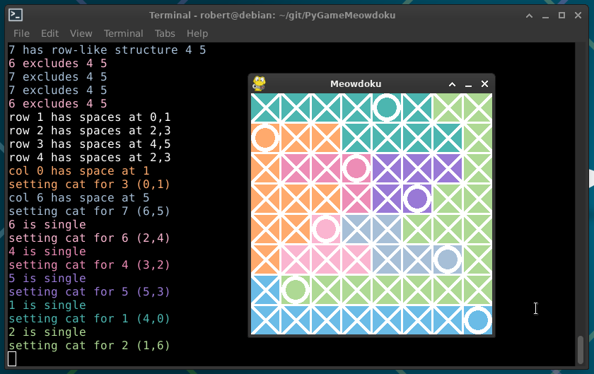

# Meowdoku solver

Create venv

```
python -m venv .venv
```

Enter venv

Windows

```
.venv/scripts/activate
```

Linux

```
source .venv/bin/activate
```

Run

```
python meowdoku meowdoku1.json
```


